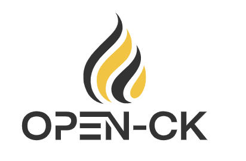
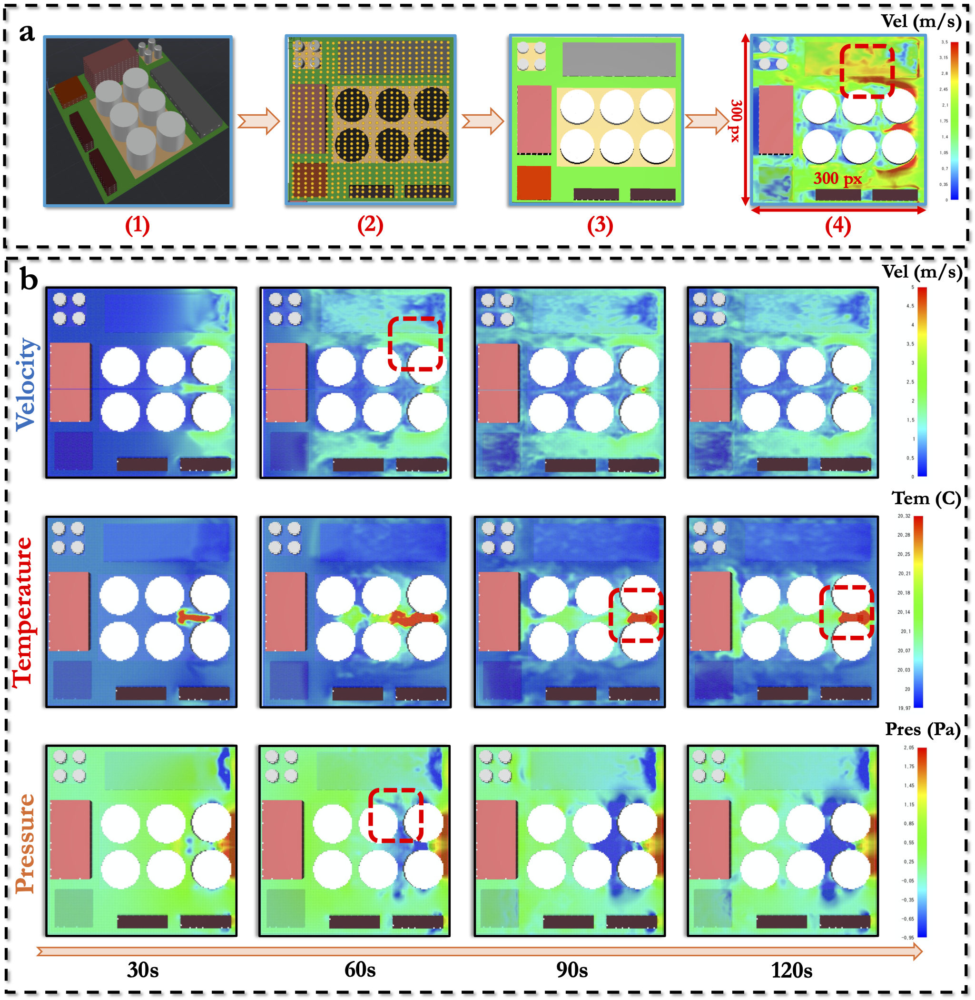
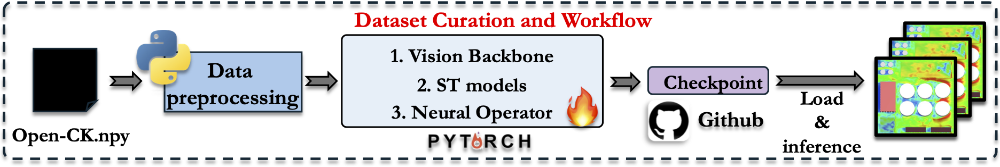

[**Chinese Documentation**](README.md) | [**English**](README-EN.md)

<p align="center">
    <br>
    
    <br>
<p>
<br>

<p align="center">
        <a href="https://www.modelscope.cn/">ModelScope</a>&nbsp ｜ &nbsp<a href="https://www.baidu.com">Demo</a>&nbsp ｜ &nbsp<a href="https://www.baidu.com">Paper</a>
</p>
<br><br>

The Open-CK dataset is a comprehensive resource designed for machine learning and scientific research in combustion dynamics. This dataset leverages the Fire Dynamics Simulator (FDS) and supercomputing resources to provide high-precision computational fluid dynamics (CFD) simulations, capturing the development of fires in industrial parks.
<br><br>
# Dataset Name
__Open-CK__
<p align="center">
    <br>
    
    <br>
<p>

<br><br>

## Project Structure
```
Open-CK/
├── README.md
├── README-EN.md
├── LICENSE
├── dataset/
│   └── README.md (Describes the storage location and characteristics of the dataset)
├── rawdata/
│   ├── README.md (Describes the characteristics of the raw data)
│   └── README-EN.md (English description of the raw data characteristics)
├── image/
│   └── images
├── script/
│   ├── csv2npy.py (Script to convert CSV files to NP arrays)
│   ├── imgshow.py (Dataset visualization script)
│   ├── readData.py (Script to read NP arrays)
│   ├── README.md (Describes script functionality)
│   └── README-EN.md (English version of the script functionality description)
└── .gitignore
```

## Dataset Acquisition
This project provides a combustion dynamics dataset for machine learning and scientific research. Due to the large size of the dataset, it is stored on Google Drive.

## Dataset Description
For detailed information about the dataset, please see [dataset/README.md](./dataset/README.md).

## Workflow
<p align="center">
    <br>
    
    <br>
<p>

## Download Dataset
The dataset can be downloaded from the following link:
[Dataset Download Link](https://drive.google.com/drive/folders/1kd6z_HsaO_YHdOMjFVp59SORWlGwL3Jb?usp=sharing)

## Terms of Use
Please refer to the [LICENSE](./LICENSE) file for terms of use.

## Contribution
Contributions are welcome! Please see [contribution_guide.md](./documentation/contribution_guide.md).