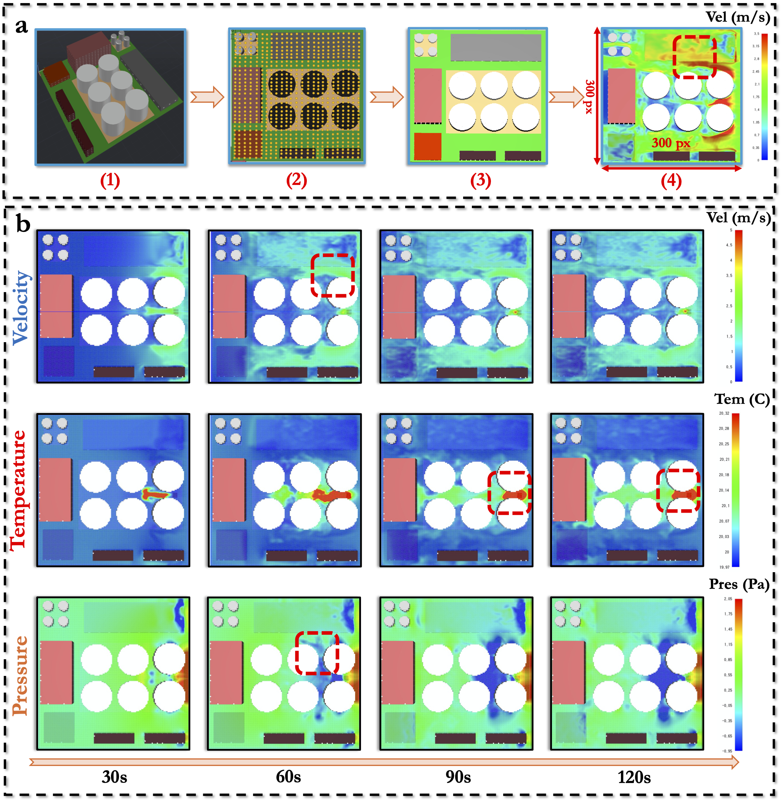

[**中文说明**](README.md) | [**English**](README-EN.md)

<p align="center">
    <br>
    
    <br>
<p>
<br>

<p align="center">
        <a href="https://www.modelscope.cn/">ModelScope</a>&nbsp ｜ &nbsp<a href="https://www.baidu.com">Demo</a>&nbsp ｜ &nbsp<a href="https://www.baidu.com">Paper</a>
</p>
<br><br>

Open-CK 数据集是一个专为燃烧动力学的机器学习和科学研究而设计的综合资源。该数据集利用火灾动力学模拟器（FDS）和超级计算资源开发，提供高精度的计算流体动力学（CFD）模拟，捕捉工业园区火灾的发展过程。
<br><br>
# 数据集名称
__Open-CK__
<p align="center">
    <br>
    
    <br>
<p>

<br><br>


## 项目结构
```
Open-CK/
├── README.md
├── README-EN.md
├── LICENSE
├── dataset/
│   └── README.md (描述数据集的存储位置以及特性)
├── rawdata/
│   ├── README.md (描述原始数据的特性)
│   └── README-EN.md (原始数据的特性的英文描述)
├── image/
│   └── images
├── script/
│   ├── csv2npy.py (csv文件转换为npy文件的脚本)
│   ├── imgshow.py (数据集可视化脚本)
│   ├── readData.py (读取npy文件脚本)
│   ├── README.md (描述脚本功能)
│   └── README-EN.md (脚本功能的英文版描述)
└── .gitignore
```

## 获取数据集
这个项目提供了一个燃烧动力学数据集，用于燃烧动力学的机器学习和科学研究。由于数据集过大，数据存储在Google Drive上。

## 数据集描述
有关数据集的详细信息，请查看 [dataset/README.md](./dataset/README.md)。

## 工作流程
<p align="center">
    <br>
    
    <br>
<p>

## 获取数据集
数据集可以从以下链接下载：
[数据集下载链接](https://drive.google.com/drive/folders/1kd6z_HsaO_YHdOMjFVp59SORWlGwL3Jb?usp=sharing)

## 使用条款
请查看 [LICENSE](./LICENSE) 文件以了解使用条款。

## 贡献
欢迎贡献！请查看 [contribution_guide.md](./documentation/contribution_guide.md)。
