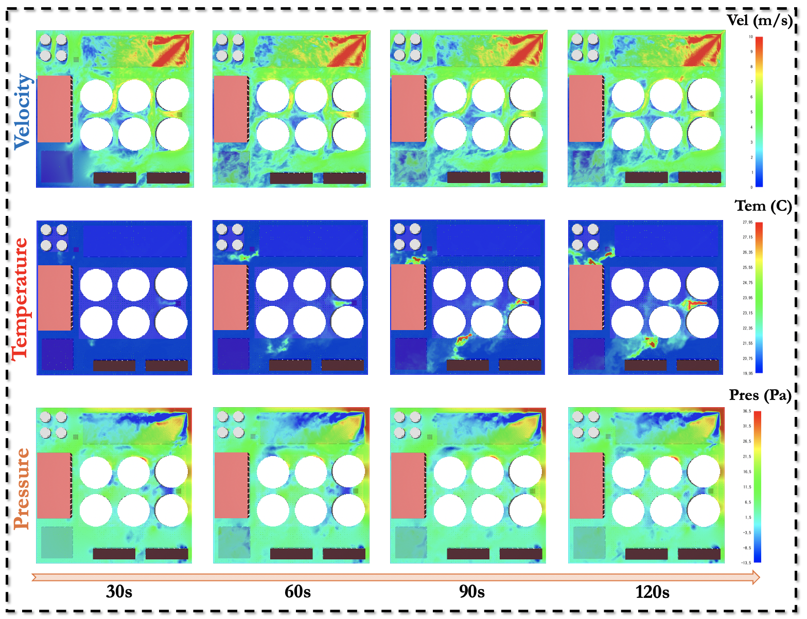

## Table: Summary of Open-CK

**NIS**: Number of Ignition Sources  
**SIS**: Single Ignition Source  
**TIS**: Three Ignition Sources  
**Tem**: Temperature  
**Vel**: Velocity  
**Pres**: Pressure

| NIS | Physical Field | Domain Spatial Resolution | Domain Spatial Resolution | △t | Timesteps |
| --- | --- | --- | --- | --- | --- |
| SIS | Tem & Vel & Pres | 300m x 300m | 300 x 300 | 1 | 350 |
| SIS | Vel | 110m x 70m | 220 x 140 | 1 | 300 |
| SIS | Tem | 20m x 20m | 40 x 40 | 0.5 | 250 |
| SIS | Pres | 20m x 20m | 20 x 20 | 2 | 350 |
| TIS | Tem & Vel & Pres | 300m x 300m | 600 x 600 | 1 | 350 |
| TIS | Tem | 110m x 70m | 220 x 140 | 1 | 300 |
| TIS | Vel | 50m x 50m | 50 x 50 | 0.5 | 300 |
| TIS | Pres | 20m x 20m | 40 x 40 | 2 | 350 |

# Dataset Visualization

     
    
     

# Download
You can download the dataset from the following link: [Open-CK](https://drive.google.com/drive/folders/1kd6z_HsaO_YHdOMjFVp59SORWlGwL3Jb?usp=sharing).
